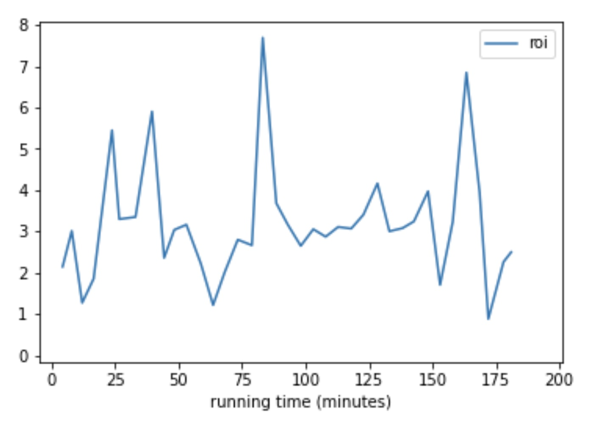
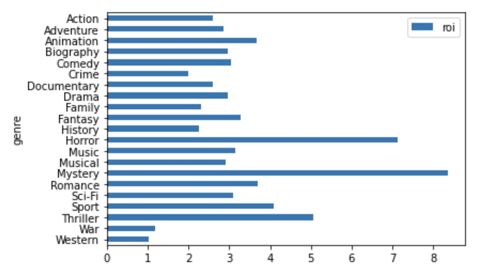
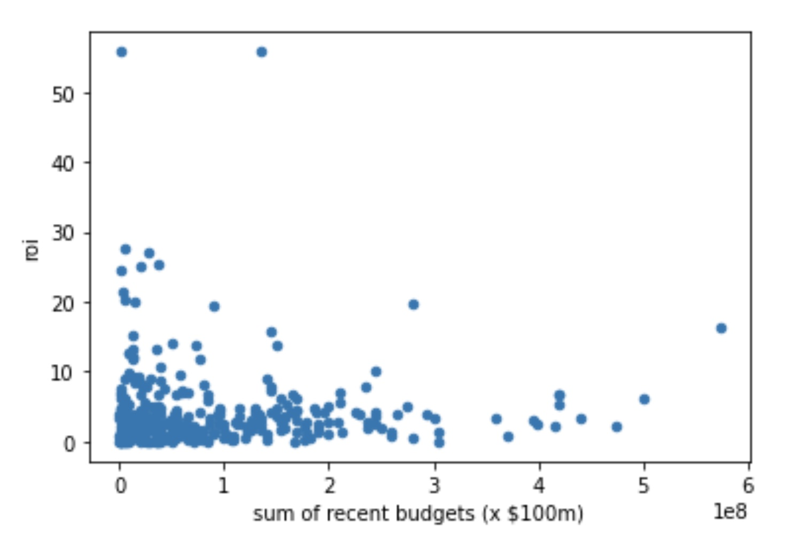
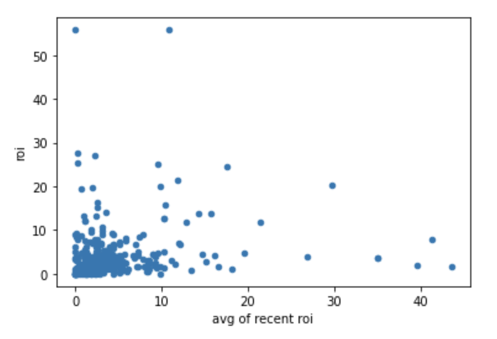

# Aaron Galbraith Flatiron Data Science Phase 1 Project

## Overview

Microsoft is interested in expanding into the business of producing movies and seeks our guidance as to what kinds of movies it should make. We have gathered from the available data that, in order to maximize the ROI of these projects, Microsoft should produce relatively short movies in the horror and mystery genres, and it should assign directors to these movies without particular concern for their past directing experience.

## Business Understanding

The first question to answer is what constitutes a successful movie. We used the simple metric of ROI, found by dividing a movie's total grosses by its budget.

We considered but dismissed an alternate metric of viewership share. It's possible that Microsoft would want to prioritize long-term brand awareness and viewer loyalty (perhaps even subscriptions to a streaming platform) at the potential expense of short-term profits. To explore this, we would need to make deeper comparisons involving how many people are viewing each movie, which would require better data than we have access to, and which might not ultimately be relevant, depending on Microsoft's specific goals.

The second question to answer is what we should attribute the success (ROI) of a movie to. Within the constraints of the data and with a focus on what elements Microsoft could control, we chose to isolate the variables of running time, genre, and the experience of the assigned director.

## Data Understanding and Analysis

The available data comes from 5 families of resources. By far the richest of these resources is IMDb. IMDb has records for the most movies of any of the resources, and it has data on running time, genre, and director assignment, all of which was ultimately relevant to our exploration.

The next most useful resource was The Numbers, which provided necessary data on movie grosses and budgets, from which we calculated ROI.

The other 3 resource families proved unusable either because their data was compromised or because their data was redundant and less extensive than others. Rotten Tomatoes, for example, has data on reviews that none of the other resources has, but its database doesn't include titles for the movies. Because its records include some fields in common with other records (such as year of release, director identity, and running time) it might have been possible to backfill *some* of these records and thereby potentially involve the other data that Rotten Tomatoes had to offer, but this would have multiplied the effort required several-fold and not necessarily been more useful than the other results we obtained.

The result from analyzing running time was rather clear. We plotted running time (in categories of 60-65 minutes, 65-70 minutes, etc.) against ROI and found several spikes. Several of these, however, corresponded to running times that were relatively rare. For example, the data appears to show that 160-165 minute movies are rather profitable, but not many such movies exist to begin with. Accordingly, we dismissed this and other spikes in the ROI plot as potentially anomalous and certainly unreliable (as well as risky). The highest spike, however, corresponded to 80-85 minutes, which is among the groups of movie running times for which there is ample data.

In order to analyze the effect of genre, it was necessary and took some effort to isolate single genres, as IMDb listed multiple genres in the majority of its records. After teasing the genres apart, it became quite clear that some were more profitable than others, namely the horror and mystery genres.

The matter of quantifying a director's experience required more feature creation than the other criteria did. To do this, we looked at movies from 2015-2018 (inclusive). Then, for the director of each movie, we calculated two quantities: (1) the **sum** of the budgets of the movies he or she had directed in the previous 5 years, and (2) the **average** ROI of the movies he or she had directed in the previous 5 years. Further, we performed this analysis three times, considering (1) all directors and all movies, (2) all directors and only movies with a budget greater than $1 million, and (3) only movies and directors of movies with a budget greater than $1 million. In all cases, the correlation showed that a director's experience has little to no effect on a movie's ROI.

In the language of statistical testing, this result would be known as "accepting the null hypothesis", where the "null hypothesis" is that there is **no** correlation between two phenomena. Such results are often overlooked, but they can often be just as illuminating as positive results, especially when they tend to contradict conventional wisdom, as we believe it does in this case.

## Conclusion

1. Produce a movie roughly 80-85 minutes in length
2. Produce a movie in the horror or mystery genre
3. Assign a director without concern for the director's previous experience